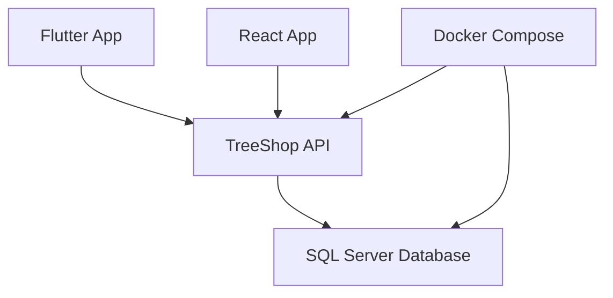

# TreeShop API

<div align="center">
  <h3>🌳 Backend RESTful API cho hệ thống TreeShop</h3>
  
  
  
  
  
  
</div>

---

## 📑 Mục lục

- [Tổng quan](#-tổng-quan)
- [Kiến trúc hệ thống](#-kiến-trúc-hệ-thống)
- [Công nghệ sử dụng](#-công-nghệ-sử-dụng)
- [Yêu cầu hệ thống](#-yêu-cầu-hệ-thống)
- [Cài đặt và chạy](#-cài-đặt-và-chạy)
- [Cấu hình cơ sở dữ liệu](#-cấu-hình-cơ-sở-dữ-liệu)
- [API Documentation](#-api-documentation)
- [Client Configuration](#-client-configuration)
  - [Flutter Setup](#flutter-setup)
  - [React Setup](#react-setup)
- [Environment Variables](#-environment-variables)
- [Deployment](#-deployment)
- [Troubleshooting](#-troubleshooting)
- [Contributing](#-contributing)
- [License](#-license)

---

## 🎯 Tổng quan

TreeShop API là một backend RESTful API được xây dựng bằng ASP.NET Core 8, cung cấp các chức năng cốt lõi cho hệ thống quản lý cửa hàng cây cảnh.

### Tính năng cơ bản cho việc quản lí (đang trong quá trình phát tiển các tính năng mới)

---

## 🏗 Kiến trúc hệ thống



### Các thành phần:

- **TreeShop API**: Web API được containerized với Docker
- **SQL Server**: Database được containerized cùng Docker Compose (tự động tạo DB khi chạy lần đầu)
- **Client Apps**: Flutter mobile app và React web app

> 💡 **Lưu ý**: Docker Compose quản lý cả Web API container **và** SQL Server container. Bạn **KHÔNG cần** cài SQL Server riêng.

---

## 🛠 Công nghệ sử dụng

| Thành phần           | Công nghệ               | Version |
| -------------------- | ----------------------- | ------- |
| **Backend**          | ASP.NET Core            | 8.0     |
| **Database**         | Microsoft SQL Server    | 2022    |
| **Containerization** | Docker & Docker Compose | Latest  |
| **Mobile**           | Flutter                 | Latest  |
| **Frontend**         | React                   | Latest  |
| **Authentication**   | JWT                     | -       |

---

## ⚡ Yêu cầu hệ thống

Đảm bảo các phần mềm sau đã được cài đặt:

- 🐳 **Docker Desktop** - [Download](https://www.docker.com/products/docker-desktop/)
- 📁 **Git** - [Download](https://git-scm.com/)
- 🔧 **SQL Server Management Studio** (Optional - để xem/quản lý DB) - [Download](https://docs.microsoft.com/en-us/sql/ssms/download-sql-server-management-studio-ssms)

> ⚠️ **KHÔNG cần** cài SQL Server. SQL Server sẽ chạy trong Docker container.

### Kiểm tra cài đặt:

```bash
docker --version
docker compose version
git --version
```

---

## 🚀 Cài đặt và chạy

### 1. Clone Repository

```bash
git clone https://github.com/Long9904/TreeShop.git
cd TreeShop
```

### 2. Chạy với Docker Compose

```bash
# Build và chạy tất cả services (SQL Server + API)
docker compose up --build

# Chạy ở chế độ detached (background)
docker compose up -d --build
```

> 🎉 **Chỉ cần lệnh trên!** SQL Server sẽ tự khởi động, tạo database `ShopDB`, và tạo tất cả bảng tự động.

### 3. Kiểm tra containers đang chạy

```bash
docker ps
# Phải thấy 2 containers: TreeShop (API) + TreeShop-SqlServer (DB)
```

### 4. Truy cập

| Service       | URL                              |
| ------------- | -------------------------------- |
| **Swagger UI** | http://localhost:9090/swagger    |
| **API Base**   | http://localhost:9090/api/v1     |
| **SQL Server** | `localhost,1433` (sa / TreeShop@123) |

### 5. Dừng services

```bash
docker compose down

# Dừng và xóa volumes (⚠️ XÓA TOÀN BỘ DATA trong DB)
docker compose down -v
```

---

## 🗄 Cấu hình cơ sở dữ liệu

> ✅ Database **tự động được tạo** khi chạy `docker compose up` lần đầu. Bạn **KHÔNG cần** làm gì thêm.

### Cấu trúc Docker:

```
TreeShop/
├── docker-compose.yml          # Quản lý cả API + SQL Server
├── Dockerfile                  # Build .NET API
├── init-db/
│   ├── entrypoint.sh          # Script khởi động SQL Server + chạy init
│   └── setup.sql              # Tạo DB và tables (idempotent)
└── TreeShop_Script_Create.sql  # Script gốc (tham khảo)
```

### Kết nối tới DB từ SSMS/Azure Data Studio:

| Field    | Value         |
| -------- | ------------- |
| Server   | `localhost,1433` |
| Login    | `sa`          |
| Password | `TreeShop@123`  |

### Muốn dùng SQL Server riêng (không dùng Docker)?

Sửa connection string trong `docker-compose.yml`:

```yaml
environment:
  - ConnectionStrings__DefaultConnection=Server=host.docker.internal,1433;Database=ShopDB;User Id=sa;Password=YOUR_PASSWORD;TrustServerCertificate=True;Encrypt=False;
```

---

## 📚 API Documentation

### Base URL

```
http://localhost:9090/api/v1
```

### Swagger UI

Truy cập Swagger Documentation tại:

```
http://localhost:9090/swagger
```

**Tính năng có sẵn:**

- 🧪 Test API endpoints
- 🔑 Authorize với JWT token
- 📊 Xem request/response schema
- 📝 Interactive API documentation

### Sample API Call

```bash
curl -X GET "http://localhost:9090/api/v1/products" \
  -H "accept: application/json"
```

---

## 💻 Client Configuration

### Flutter Setup

#### Mục tiêu

Sau khi cấu hình, chỉ cần gọi:

```dart
ApiClient.get("/products");
```

#### Bước 1: Tạo App Config

**File**: `lib/core/config/app_config.dart`

```dart
class AppConfig {
  static const String baseUrl = "http://10.0.2.2:9090/api/v1";

  // Cho thiết bị thật, dùng IP máy:
  // static const String baseUrl = "http://192.168.1.5:9090/api/v1";
}
```

> ⚠️ **Quan trọng**: Android Emulator sử dụng `10.0.2.2` thay vì `localhost`

#### Bước 2: Tạo API Client

**File**: `lib/core/network/api_client.dart`

```dart
import 'dart:convert';
import 'package:http/http.dart' as http;
import '../config/app_config.dart';

class ApiClient {
  static Map<String, String> _headers({String? token}) {
    return {
      "Content-Type": "application/json",
      if (token != null) "Authorization": "Bearer $token",
    };
  }

  static Future<http.Response> get(String path, {String? token}) {
    return http.get(
      Uri.parse("${AppConfig.baseUrl}$path"),
      headers: _headers(token: token),
    );
  }

  static Future<http.Response> post(String path, dynamic body, {String? token}) {
    return http.post(
      Uri.parse("${AppConfig.baseUrl}$path"),
      headers: _headers(token: token),
      body: jsonEncode(body),
    );
  }

  static Future<http.Response> put(String path, dynamic body, {String? token}) {
    return http.put(
      Uri.parse("${AppConfig.baseUrl}$path"),
      headers: _headers(token: token),
      body: jsonEncode(body),
    );
  }

  static Future<http.Response> delete(String path, {String? token}) {
    return http.delete(
      Uri.parse("${AppConfig.baseUrl}$path"),
      headers: _headers(token: token),
    );
  }
}
```

#### Bước 3: Sử dụng trong project

```dart
try {
  final response = await ApiClient.get("/products");

  if (response.statusCode == 200) {
    final data = jsonDecode(response.body);
    print(data);
  }
} catch (e) {
  print("Error: $e");
}
```

### React Setup

#### Tạo Axios Client

**File**: `src/api/axiosClient.js`

```javascript
import axios from "axios";

const axiosClient = axios.create({
  baseURL: "http://localhost:9090/api/v1",
  headers: {
    "Content-Type": "application/json",
  },
});

// Request interceptor để thêm token
axiosClient.interceptors.request.use(
  (config) => {
    const token = localStorage.getItem("token");
    if (token) {
      config.headers.Authorization = `Bearer ${token}`;
    }
    return config;
  },
  (error) => {
    return Promise.reject(error);
  },
);

export default axiosClient;
```

#### Sử dụng trong component

```javascript
import axiosClient from "../api/axiosClient";

// GET request
axiosClient
  .get("/products")
  .then((res) => console.log(res.data))
  .catch((err) => console.error(err));

// POST request
axiosClient
  .post("/products", { name: "New Product", price: 100 })
  .then((res) => console.log(res.data));
```

---

## 🔧 Environment Variables

### Docker Compose Configuration

**File**: `docker-compose.yml`

> ✅ Mặc định đã cấu hình sẵn, **KHÔNG cần** sửa gì nếu dùng Docker SQL Server.

```yaml
environment:
  # SQL Server (container)
  - ACCEPT_EULA=Y
  - MSSQL_SA_PASSWORD=TreeShop@123

  # Web API
  - ConnectionStrings__DefaultConnection=Server=sqlserver,1433;Database=ShopDB;User Id=sa;Password=TreeShop@123;TrustServerCertificate=True;Encrypt=False;
  - JwtSettings__SecretKey=iemduelqfopeiovjovmedocmelqnvvie
  - JwtSettings__Issuer=tree-shop
  - JwtSettings__Audience=tree-shop-users
```

---

## 🌐 Deployment

### Production Best Practices

#### ❌ Không nên:

- Hardcode passwords trong source code
- Sử dụng account `sa` trong production
- Commit secret keys vào repository
- Sử dụng HTTP trong production

#### ✅ Nên làm:

- Sử dụng `.env` files cho environment variables
- Implement HTTPS/SSL
- Deploy database riêng biệt (Azure SQL Database, AWS RDS)
- Sử dụng reverse proxy (Nginx, IIS)
- Implement proper logging và monitoring

### Sample `.env` file:

```env
DB_CONNECTION_STRING=your-production-connection-string
JWT_SECRET_KEY=your-production-secret-key
JWT_ISSUER=tree-shop-prod
JWT_AUDIENCE=tree-shop-users-prod
```

---

## 🔍 Troubleshooting

### Vấn đề thường gặp

#### ❌ Flutter/React không kết nối được API

**Kiểm tra:**

- CORS đã được enable trong API chưa?
- Sử dụng đúng IP address (Flutter emulator → dùng `10.0.2.2`, không phải `localhost`)
- Windows Firewall có block port không?
- API container có đang chạy không?

**Giải pháp:**

```bash
# Kiểm tra containers
docker ps

# Xem logs của API
docker logs TreeShop

# Xem logs của SQL Server
docker logs TreeShop-SqlServer
```

#### ❌ Database connection failed

**Kiểm tra:**

```bash
# Kiểm tra SQL Server đã healthy chưa
docker ps
# Cột STATUS phải hiện "healthy"

# Xem logs SQL Server
docker logs TreeShop-SqlServer

# Restart toàn bộ
docker compose down
docker compose up --build
```

> 💡 **Lưu ý**: Nếu SQL Server chưa healthy, API sẽ không start (nhờ `depends_on` + healthcheck).

#### ❌ Port conflicts

Nếu port 9090 hoặc 1433 đã được sử dụng:

1. Dừng services đang chạy trên các port này
2. Hoặc sửa ports trong `docker-compose.yml`

---

## 🤝 Contributing

---

## 📄 License

This project is licensed under the MIT License - see the [LICENSE](LICENSE) file for details.

---

## 👨‍💻 Author

**Mahiru**

- GitHub: [@mahiru-username](https://github.com/Long9904)
- Email: longvu09092004@gmail.com

---

<div align="center">
  <p>⭐ Nếu project này hữu ích, hãy cho một star nhé!</p>
  <p>Made with ❤️ by Mahiru</p>
</div>
