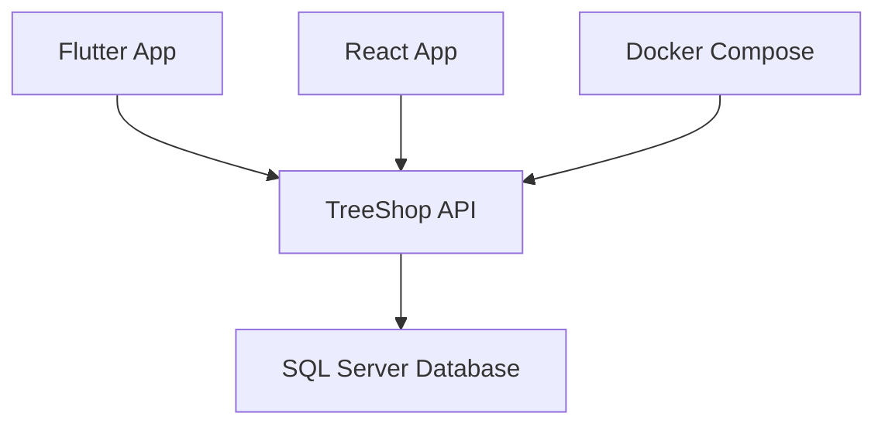

# TreeShop API

<div align="center">
  <h3>🌳 Backend RESTful API cho hệ thống TreeShop</h3>
  
  
  
  
  
  
</div>

---

## 📑 Mục lục

- [Tổng quan](#-tổng-quan)
- [Kiến trúc hệ thống](#-kiến-trúc-hệ-thống)
- [Công nghệ sử dụng](#-công-nghệ-sử-dụng)
- [Yêu cầu hệ thống](#-yêu-cầu-hệ-thống)
- [Cài đặt và chạy](#-cài-đặt-và-chạy)
- [Cấu hình cơ sở dữ liệu](#-cấu-hình-cơ-sở-dữ-liệu)
- [API Documentation](#-api-documentation)
- [Client Configuration](#-client-configuration)
  - [Flutter Setup](#flutter-setup)
  - [React Setup](#react-setup)
- [Environment Variables](#-environment-variables)
- [Deployment](#-deployment)
- [Troubleshooting](#-troubleshooting)
- [Contributing](#-contributing)
- [License](#-license)

---

## 🎯 Tổng quan

TreeShop API là một backend RESTful API được xây dựng bằng ASP.NET Core 8, cung cấp các chức năng cốt lõi cho hệ thống quản lý cửa hàng cây cảnh.

### Tính năng cơ bản cho việc quản lí (đang trong quá trình phát tiển các tính năng mới)

---

## 🏗 Kiến trúc hệ thống



### Các thành phần:

- **TreeShop API**: Web API được containerized với Docker
- **SQL Server**: Database do bạn tự quản lý (không được containerized)
- **Client Apps**: Flutter mobile app và React web app

> 💡 **Lưu ý**: Docker Compose chỉ quản lý Web API container. SQL Server cần được cài đặt và cấu hình riêng.

---

## 🛠 Công nghệ sử dụng

| Thành phần           | Công nghệ               | Version |
| -------------------- | ----------------------- | ------- |
| **Backend**          | ASP.NET Core            | 8.0     |
| **Database**         | Microsoft SQL Server    | 2022    |
| **Containerization** | Docker & Docker Compose | Latest  |
| **Mobile**           | Flutter                 | Latest  |
| **Frontend**         | React                   | Latest  |
| **Authentication**   | JWT                     | -       |

---

## ⚡ Yêu cầu hệ thống

Đảm bảo các phần mềm sau đã được cài đặt:

- 🐳 **Docker Desktop** - [Download](https://www.docker.com/products/docker-desktop/)
- 📁 **Git** - [Download](https://git-scm.com/)
- 🔧 **SQL Server Management Studio** (Optional) - [Download](https://docs.microsoft.com/en-us/sql/ssms/download-sql-server-management-studio-ssms)

### Kiểm tra cài đặt:

```bash
docker --version
docker compose version
git --version
```

---

## 🚀 Cài đặt và chạy

### 1. Clone Repository

```bash
git clone https://github.com/Long9904/TreeShop.git
cd TreeShop
```

### 2. Chạy với Docker Compose

```bash
# Build và chạy tất cả services
docker compose up --build

# Chạy ở chế độ detached (background)
docker compose up -d --build
```

### 3. Kiểm tra containers đang chạy

```bash
docker ps
```

### 4. Dừng services

```bash
docker compose down

# Dừng và xóa volumes (reset database)
docker compose down -v
```

---

## 🗄 Cấu hình cơ sở dữ liệu

> ⚠️ **QUAN TRỌNG**: Bạn cần có SQL Server riêng và tự cấu hình connection string trong `docker-compose.yml`. Project chỉ cung cấp script database, không bao gồm SQL Server container.

### Yêu cầu trước khi chạy:

1. **Có sẵn SQL Server** (Local hoặc Remote)
2. **Chạy script database** được cung cấp trong project
3. **Cập nhật connection string** trong `docker-compose.yml`

### Các bước cấu hình:

#### Bước 1: Chuẩn bị SQL Server

- Cài đặt SQL Server (hoặc sử dụng SQL Server có sẵn)
- Tạo database cho project
- Chạy script database được cung cấp

#### Bước 2: Cấu hình docker-compose.yml

Sửa connection string trong file `docker-compose.yml`:

```yaml
environment:
  - ConnectionStrings__DefaultConnection=Server=YOUR_SERVER;Database=YOUR_DATABASE;User Id=YOUR_USERNAME;Password=YOUR_PASSWORD;TrustServerCertificate=True;Encrypt=False;
```

**Ví dụ cấu hình:**

| Scenario               | Connection String Example                                                                                                            |
| ---------------------- | ------------------------------------------------------------------------------------------------------------------------------------ |
| **Local SQL Server**   | `Server=host.docker.internal;Database=TreeShopDB;User Id=sa;Password=YourPassword123!;TrustServerCertificate=True;Encrypt=False;`    |
| **Remote SQL Server**  | `Server=192.168.1.100,1433;Database=TreeShopDB;User Id=sqluser;Password=YourPassword123!;TrustServerCertificate=True;Encrypt=False;` |
| **Azure SQL Database** | `Server=yourserver.database.windows.net;Database=TreeShopDB;User Id=yourusername;Password=YourPassword123!;Encrypt=True;`            |

### Công cụ kết nối database:

- **SQL Server Management Studio** (SSMS)
- **Azure Data Studio**
- **DBeaver**
- **VS Code SQL Server Extension**

> 💡 **Lưu ý**: Project chỉ cung cấp API code và database scripts. Bạn cần tự quản lý SQL Server instance.

---

## 📚 API Documentation

### Base URL

```
http://localhost:8080/api/v1
```

### Swagger UI

Truy cập Swagger Documentation tại:

```
http://localhost:8080/swagger
```

**Tính năng có sẵn:**

- 🧪 Test API endpoints
- 🔑 Authorize với JWT token
- 📊 Xem request/response schema
- 📝 Interactive API documentation

### Sample API Call

```bash
curl -X GET "http://localhost:8080/api/v1/products" \
  -H "accept: application/json"
```

---

## 💻 Client Configuration

### Flutter Setup

#### Mục tiêu

Sau khi cấu hình, chỉ cần gọi:

```dart
ApiClient.get("/products");
```

#### Bước 1: Tạo App Config

**File**: `lib/core/config/app_config.dart`

```dart
class AppConfig {
  static const String baseUrl = "http://10.0.2.2:8080/api/v1";

  // Cho thiết bị thật, dùng IP máy:
  // static const String baseUrl = "http://192.168.1.5:8080/api/v1";
}
```

> ⚠️ **Quan trọng**: Android Emulator sử dụng `10.0.2.2` thay vì `localhost`

#### Bước 2: Tạo API Client

**File**: `lib/core/network/api_client.dart`

```dart
import 'dart:convert';
import 'package:http/http.dart' as http;
import '../config/app_config.dart';

class ApiClient {
  static Map<String, String> _headers({String? token}) {
    return {
      "Content-Type": "application/json",
      if (token != null) "Authorization": "Bearer $token",
    };
  }

  static Future<http.Response> get(String path, {String? token}) {
    return http.get(
      Uri.parse("${AppConfig.baseUrl}$path"),
      headers: _headers(token: token),
    );
  }

  static Future<http.Response> post(String path, dynamic body, {String? token}) {
    return http.post(
      Uri.parse("${AppConfig.baseUrl}$path"),
      headers: _headers(token: token),
      body: jsonEncode(body),
    );
  }

  static Future<http.Response> put(String path, dynamic body, {String? token}) {
    return http.put(
      Uri.parse("${AppConfig.baseUrl}$path"),
      headers: _headers(token: token),
      body: jsonEncode(body),
    );
  }

  static Future<http.Response> delete(String path, {String? token}) {
    return http.delete(
      Uri.parse("${AppConfig.baseUrl}$path"),
      headers: _headers(token: token),
    );
  }
}
```

#### Bước 3: Sử dụng trong project

```dart
try {
  final response = await ApiClient.get("/products");

  if (response.statusCode == 200) {
    final data = jsonDecode(response.body);
    print(data);
  }
} catch (e) {
  print("Error: $e");
}
```

### React Setup

#### Tạo Axios Client

**File**: `src/api/axiosClient.js`

```javascript
import axios from "axios";

const axiosClient = axios.create({
  baseURL: "http://localhost:8080/api/v1",
  headers: {
    "Content-Type": "application/json",
  },
});

// Request interceptor để thêm token
axiosClient.interceptors.request.use(
  (config) => {
    const token = localStorage.getItem("token");
    if (token) {
      config.headers.Authorization = `Bearer ${token}`;
    }
    return config;
  },
  (error) => {
    return Promise.reject(error);
  },
);

export default axiosClient;
```

#### Sử dụng trong component

```javascript
import axiosClient from "../api/axiosClient";

// GET request
axiosClient
  .get("/products")
  .then((res) => console.log(res.data))
  .catch((err) => console.error(err));

// POST request
axiosClient
  .post("/products", { name: "New Product", price: 100 })
  .then((res) => console.log(res.data));
```

---

## 🔧 Environment Variables

### Docker Compose Configuration

**File**: `docker-compose.yml`

```yaml
environment:
  # Cập nhật connection string cho SQL Server của bạn
  - ConnectionStrings__DefaultConnection=Server=YOUR_SERVER;Database=YOUR_DATABASE;User Id=YOUR_USERNAME;Password=YOUR_PASSWORD;TrustServerCertificate=True;Encrypt=False;
  - JwtSettings__SecretKey=your-secret-key-here
  - JwtSettings__Issuer=tree-shop
  - JwtSettings__Audience=tree-shop-users
  - ASPNETCORE_ENVIRONMENT=Development
```

### Connection String Examples:

```yaml
# Local SQL Server
- ConnectionStrings__DefaultConnection=Server=host.docker.internal;Database=TreeShopDB;User Id=sa;Password=YourPassword123!;TrustServerCertificate=True;Encrypt=False;

# Remote SQL Server
- ConnectionStrings__DefaultConnection=Server=192.168.1.100,1433;Database=TreeShopDB;User Id=sqluser;Password=YourPassword123!;TrustServerCertificate=True;Encrypt=False;

# Azure SQL Database
- ConnectionStrings__DefaultConnection=Server=yourserver.database.windows.net;Database=TreeShopDB;User Id=yourusername;Password=YourPassword123!;Encrypt=True;
```

---

## 🌐 Deployment

### Production Best Practices

#### ❌ Không nên:

- Hardcode passwords trong source code
- Sử dụng account `sa` trong production
- Commit secret keys vào repository
- Sử dụng HTTP trong production

#### ✅ Nên làm:

- Sử dụng `.env` files cho environment variables
- Implement HTTPS/SSL
- Deploy database riêng biệt (Azure SQL Database, AWS RDS)
- Sử dụng reverse proxy (Nginx, IIS)
- Implement proper logging và monitoring

### Sample `.env` file:

```env
DB_CONNECTION_STRING=your-production-connection-string
JWT_SECRET_KEY=your-production-secret-key
JWT_ISSUER=tree-shop-prod
JWT_AUDIENCE=tree-shop-users-prod
```

---

## 🔍 Troubleshooting

### Vấn đề thường gặp

#### ❌ Flutter/React không kết nối được API

**Kiểm tra:**

- CORS đã được enable trong API chưa?
- Sử dụng đúng IP address (không phải `localhost`)
- Windows Firewall có block port không?
- API container có đang chạy không?

**Giải pháp:**

```bash
# Kiểm tra containers
docker ps

# Xem logs của API
docker logs treeshop-api

# Kiểm tra network
docker network ls
```

#### ❌ Database connection failed

**Kiểm tra:**

- Connection string trong `docker-compose.yml` có đúng không?
- SQL Server có đang chạy không?
- Database có tồn tại không?
- Script database đã được chạy chưa?

**Giải pháp:**

```bash
# Kiểm tra API container logs
docker logs treeshop-api

# Restart API container
docker compose restart
```

> 💡 **Lưu ý**: Nếu vẫn lỗi, hãy kiểm tra SQL Server và chạy lại script database.

#### ❌ Port conflicts

Nếu port 8080 hoặc 1500 đã được sử dụng:

1. Dừng services đang chạy trên các port này
2. Hoặc sửa ports trong `docker-compose.yml`

---

## 🤝 Contributing

---

## 📄 License

This project is licensed under the MIT License - see the [LICENSE](LICENSE) file for details.

---

## 👨‍💻 Author

**Mahiru**

- GitHub: [@mahiru-username](https://github.com/Long9904)
- Email: longvu09092004@gmail.com

---

<div align="center">
  <p>⭐ Nếu project này hữu ích, hãy cho một star nhé!</p>
  <p>Made with ❤️ by Mahiru</p>
</div>
